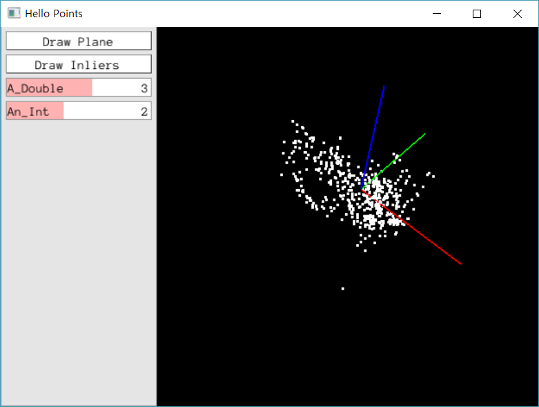
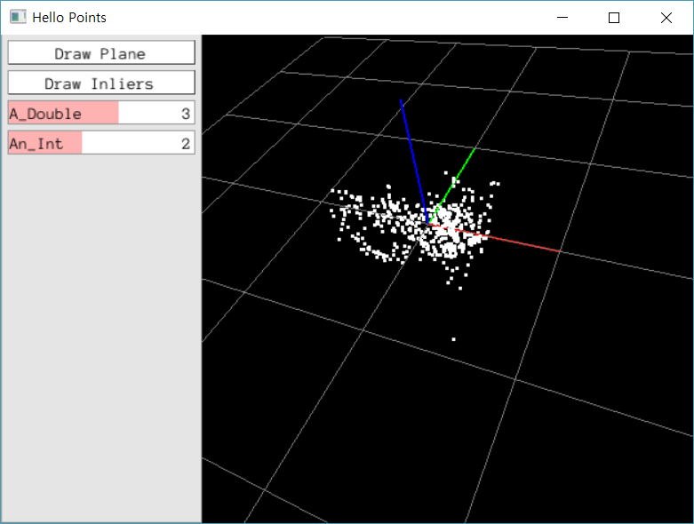

# PangolinTestWIn
Pangolin in Windows

### Example 1 : Hello

### Example 3 : Ransac plane fit

## Build Pangolin
 Make a directory called build in orbslam-windows/Thirdparty/Pangolin
- Run CMake GUI and set source code to orbslam-windows/Thirdparty/Pangolin and where to build the binaries to orbslam-windows/Thirdparty/Pangolin/build
- Press Configure and choose Visual Studio 14 2015 Win64 or Visual Studio 12 2013 Win64. You'll have a lot of RED and a lot of things that say DIR-NOTFOUND but as long as the window at the bottom says Configuring Done you're fine
- Press Generate
- Open the resulting project in the build directory in Visual Studio
- Change build type to Release (in white box up top, should initially say Debug)
- Build ALL_BUILD. You'll have an error by project testlog that says "cannot open input file 'pthread.lib'" but that doesn't matter cause we don't use testlog. Everything else should build fine, i.e., you should have
========== Build: 18 succeeded, 1 failed, 0 up-to-date, 0 skipped ==========
See https://github.com/Phylliida/orbslam-windows/blob/master/README.md
